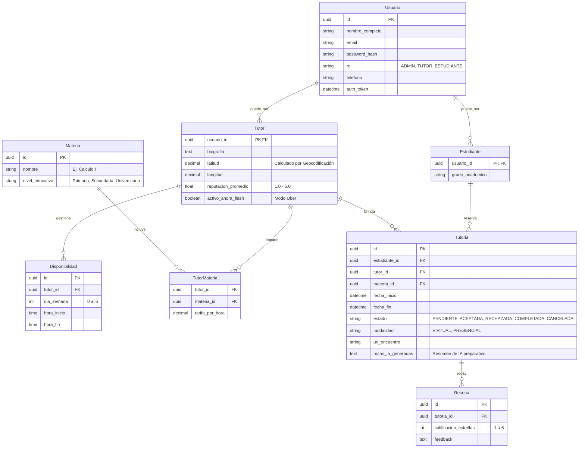

# Diseño de Base de Datos - "TutoresOn-Line"

Este documento presenta la estructura informacional. Utilizaremos un esquema de **Base de Datos Relacional (PostgreSQL)** garantizando la estructura ACID (Atomicidad, Consistencia, Aislamiento y Durabilidad), ideal para una dApp que maneja reservas de recursos (tiempo de tutores).

## Diagrama Entidad-Relación (MER)

## Justificación Técnicas Clave
1. **Delegación de Autenticación (`Usuario` como entidad ancla):** Evita la duplicación de manejo de Login si alguien es ambos: Estudiante y a la vez Tutor.
2. **Disponibilidad por Franjas:** Permite escalabilidad al momento de hacer búsquedas eficientes en bases de datos con cláusulas granulares sobre el reloj con precisión militar.
3. **Puntuación pre-calulada:** En `Tutor.reputacion_promedio` guardaremos una copia pre calculada mediante un Trigger/Job del sistema para evitar cálculos lentos al buscar profesores velozmente en la vista.
